# ChattingApp 
<b>Steps:</b> 
i) Create one firebase project and create one android application with it. 
ii) Download google-services.json file and add the file in app folder of this project. 
iii) Start email password authentication and realtime database of firebase project. 
iv) Now run the project you will get following screens. 
<b>Screenshots:</b> 
<b>Light Theme:</b> 

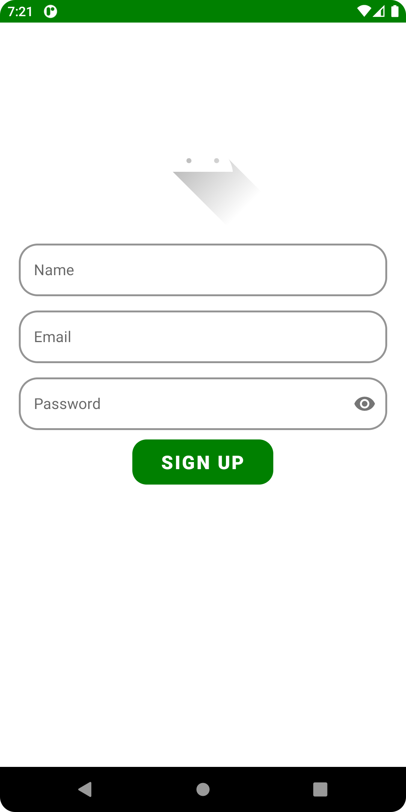
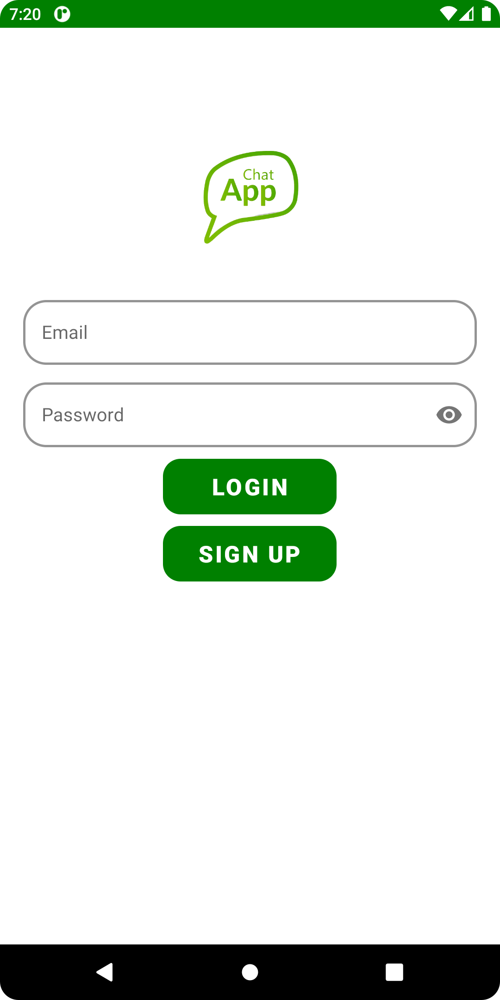
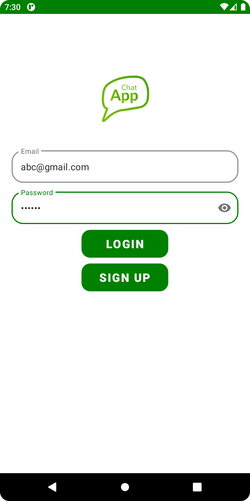
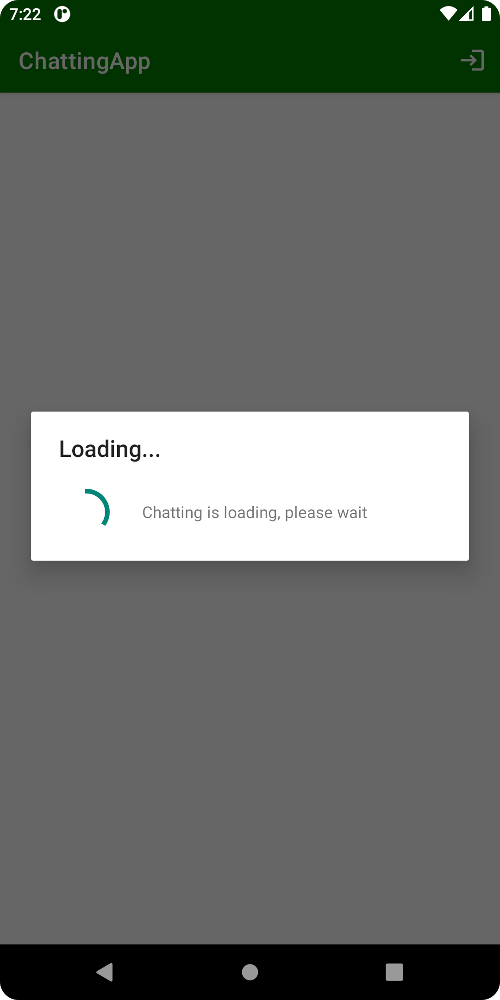
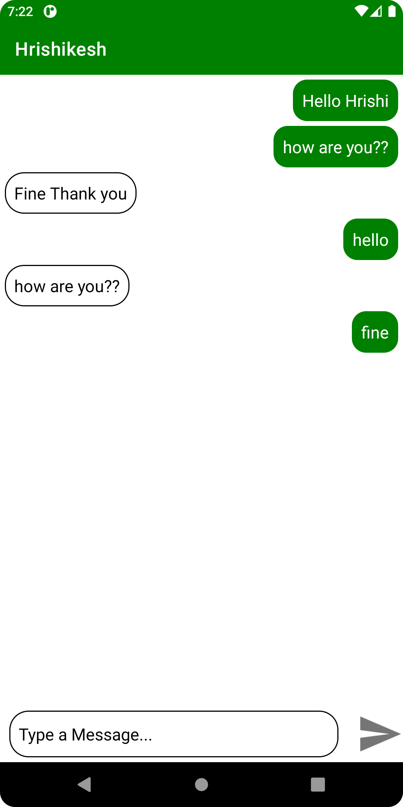
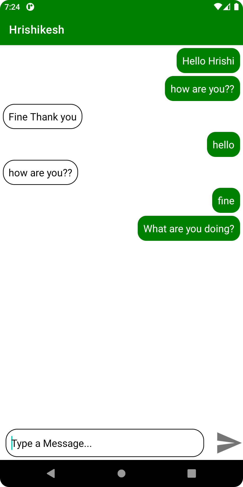
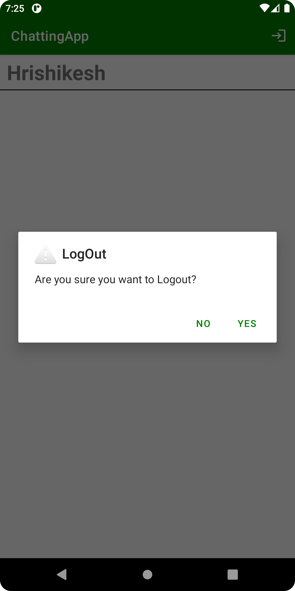
<b>Dark Theme:</b> 

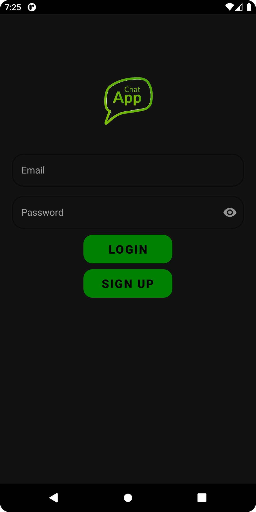
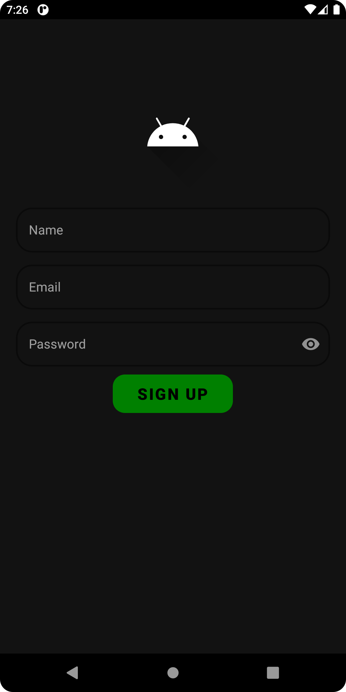
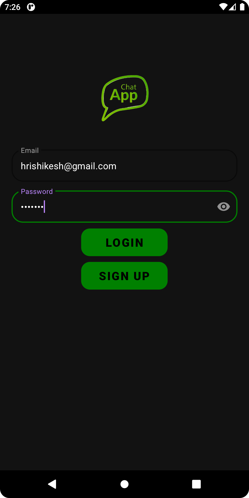
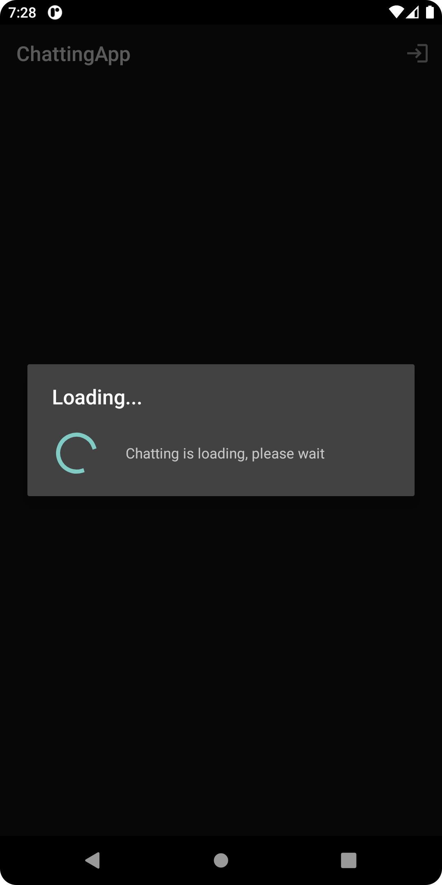
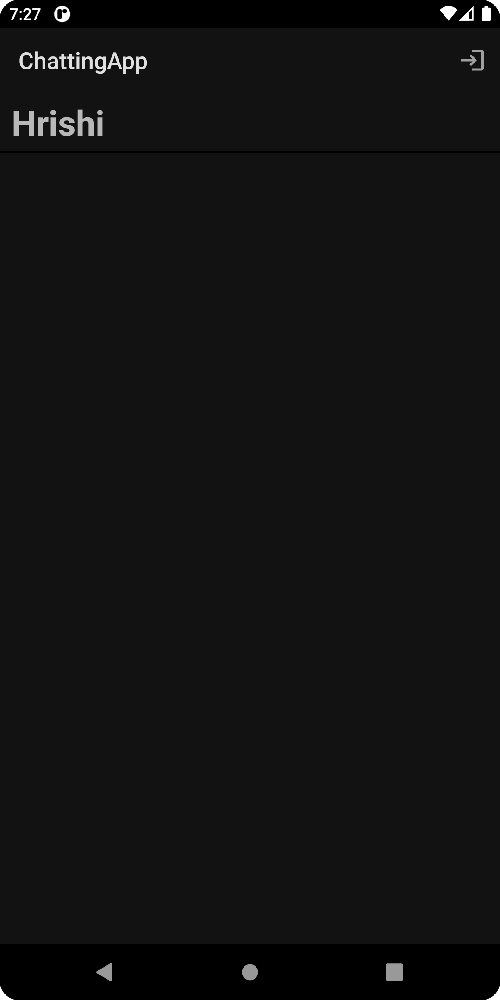
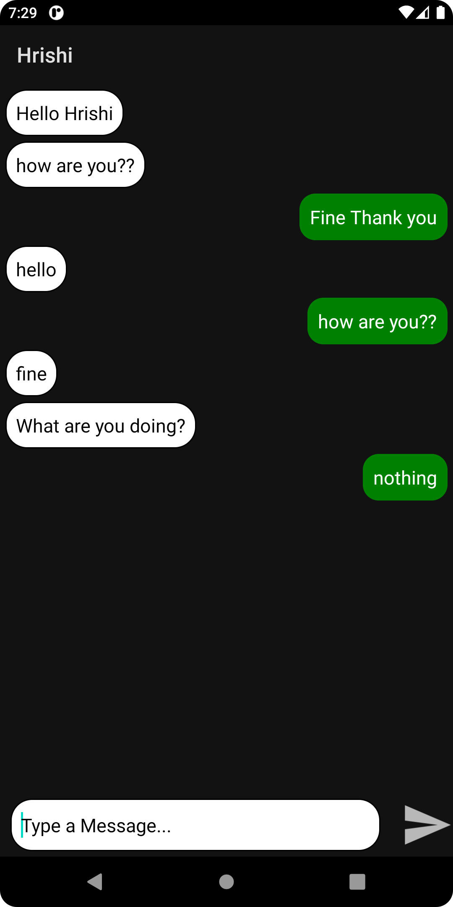
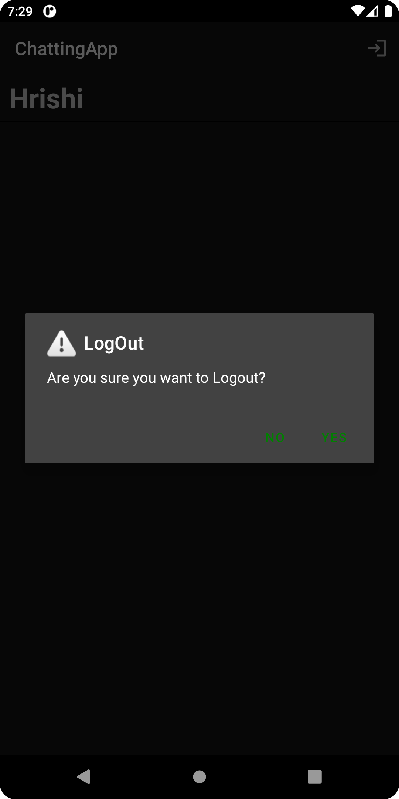
